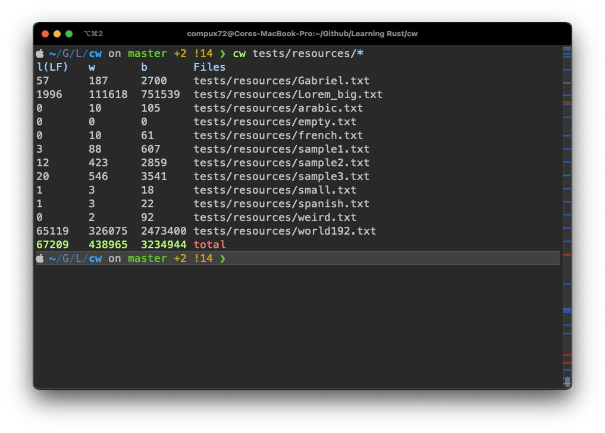

# cw
cw (*count words*) is a faster alternative to classic GNU wc, written on pure
Rust. It provides the same tools as wc, but with some extras, such as 
multithreading and multiple encoding support. cw also provides its core 
functionality as a library that can target any platform, including `wasm`, with 
no platform-specific code. The Rust compiler leverages great performance 
with stupidly simple source code

cw diferenciates itself from other wc clones by providing great defaults. cw 
will always count characters using the provided encoding, and thus, always
providing the right count. Other word counter will provide, for example, wrong
max line length on UTF-8 encoded text



# Build and install cw from source (recommended)

Because cw is written entiretly on Rust, is as simple as using `cargo`. If you
already have installed [`cargo`](https://doc.rust-lang.org/cargo/getting-started/installation.html) 
on your system, run the folowing on the commandline:

```bash
cargo install --git https://github.com/Altair-Bueno/cw.git
```

> Warning: This will install cw on `$HOME/.cargo/bin`. Ensure this location is 
> on your shell's `$PATH` variable by running `echo $PATH | grep '.cargo/bin'`

# Uninstalling

Run this from the commandline

```bash
cargo uninstall cw
```

# Features
The same functionality you'll expect from GNU wc, but with some extras. To see
the full list of options, type `cw -h` or `cw --help`:

## Multithreading
When provided multiple files, cw can process them sequentially or in parallel
by providing the `-t <n>` option. It will use n additional threads to process
all files

## Different encodings and Linebreaks
By default, cw will search for UTF-8 encoded text, with LF (`U+000A`) line 
breaks. Note that this crate **does not** validate any input. It asumes it's 
encoded correctly, althought invalid encoded input is safely managed

# Performance
See [BENCH.md](BENCH.md)

# Wishlist

- Full unicode support (eg proccess Z҉͈͓͈͎a̘͈̠̭l̨̯g̶̬͇̭o̝̹̗͎̙ ͟t͖̙̟̹͇̥̝͡e̥͘x͚̺̭̻͘t͉͔̩̲̘ correctly)
- UTF-16 encoding
- Auto-detect file encoding
- Make cw faster